# La Hacienda
*Por: Brian Jiménez Moedano*

*Julio 2023*

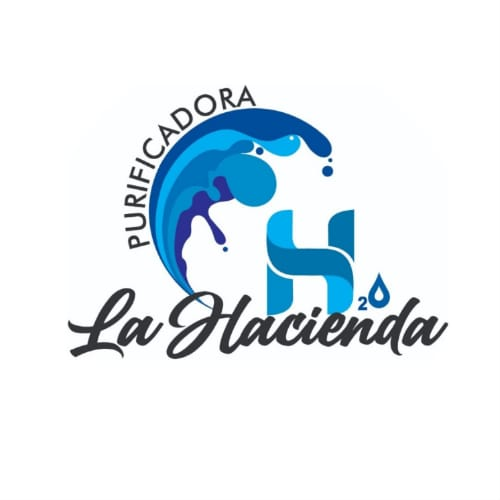

## Descripción

**La Hacienda** es una aplicación que sirve para **hacer pedidos de agua potable a domicilio.** El nombre lo toma de una **purificadora real** ubicada en el Edo. de México, cuyo **dueño y amigo mío me pidio desarrollar una App para dicho negocio.** Este proyecto, ha sido uno de mis más grandes logros como Freelance a la fecha, **utiliza una arquitectura MVVM, patrones de delegamiento, observabilidad, inyección de dependiencias, adaptabilidad y segregación de interfaces.** También incorpora un **servicio de BackEnd de Google-FireBase para la autenticación y manejo de base de datos sincronizada en tiempo real.**

## Características

- Aplicación que permite hacer pedidos de agua potable a domicilio.
- Diseño de arquitectura **MVVM** que incorpora **patrones de observabilidad, delegamiento, adaptabilidad y segregación de interfaces.**
- Servicio de **autenticación a través de Google FireBase Auth.**
- Servicio de **base de datos con sincronización en tiempo real a través de Google FireStore.**
- Uso del API nativo **MapKit para buscar y seleccionar marcaciones en mapas.**
- El usuario puede **registrarse, iniciar sesión, mantener esa sesión abierta al cierre y apertura de la App, y cerrar sesión.**
- El usuario puede **ordenar agua, chatear con el proveedor, monitorear el estado de la orden, consultar su historial de pedidos y modificar sus datos de contacto, todo con actualizaciones en tiempo real.**
- Uso del API **UIKit para la interfaz gráfica,** así como **animaciones y layouts dinámicos y responsivos.**

## Cómo Utilizarla

Al abrir la aplicación, el usuario podrá **registrarse** o **iniciar sesión.**

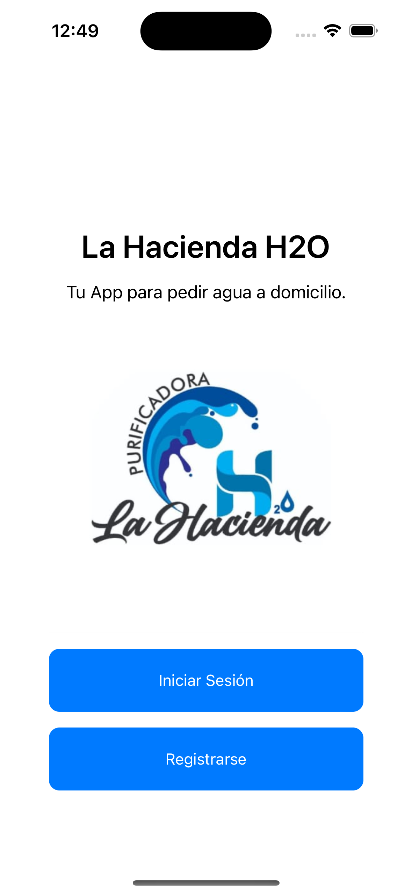

La pantalla **transiciona entre el registro y el inicio de sesión por medio de una animación.** En el caso del **registro**, el usuario se puede apoyar de un **buscador de direcciones embebido en el campo de text o de un mapa interactivo utilizando su geo-posición actual.**

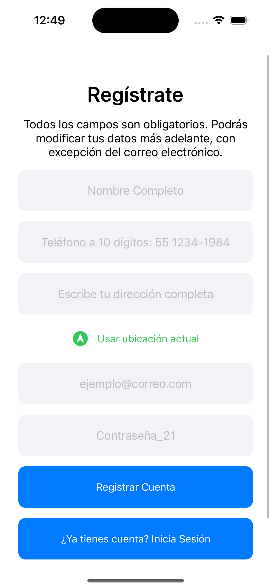
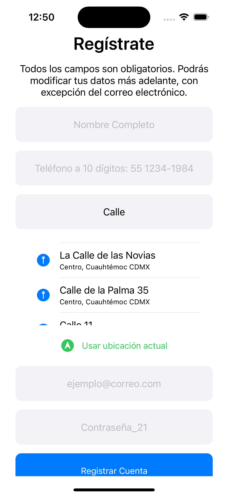
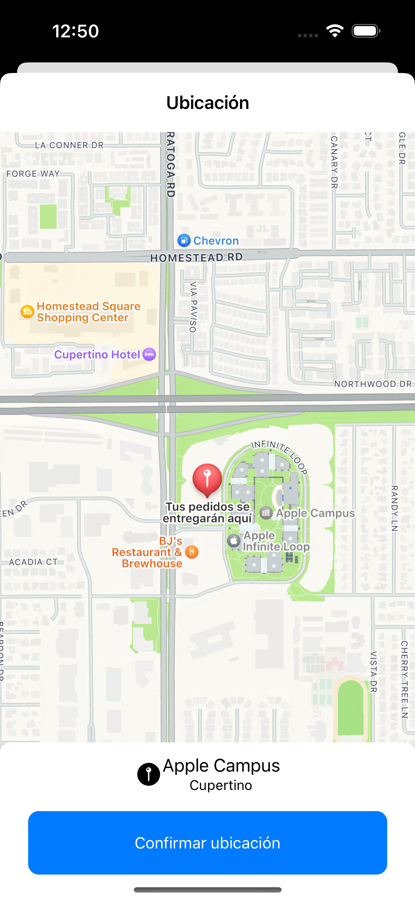
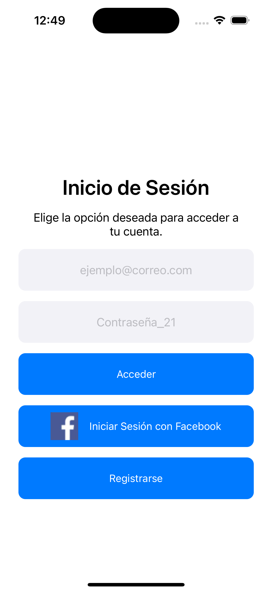

Al iniciar sesión, el usuario se encontrará en una **pantalla con cuatro pestañas de navegación disponibles: Inicio, Ordenar, Historial y Configuración.**

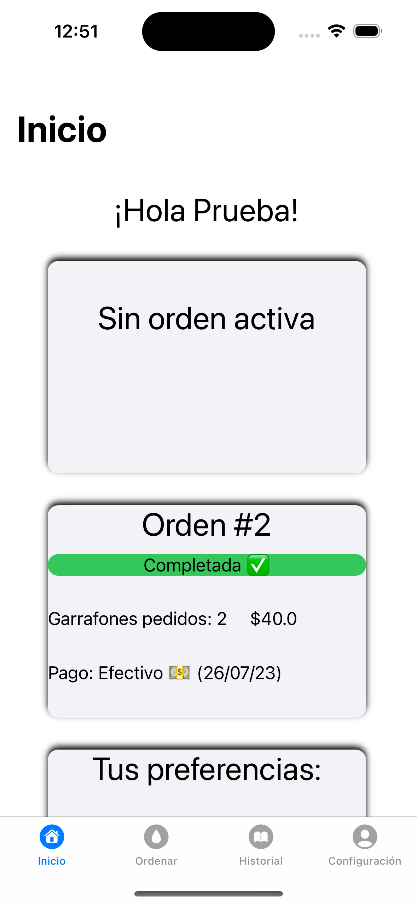

**Desde la pantalla de inicio, el usuario puede visualizar su orden activa, su último pedido, sus datos de contacto, y los datos de contacto de la purificadora.**

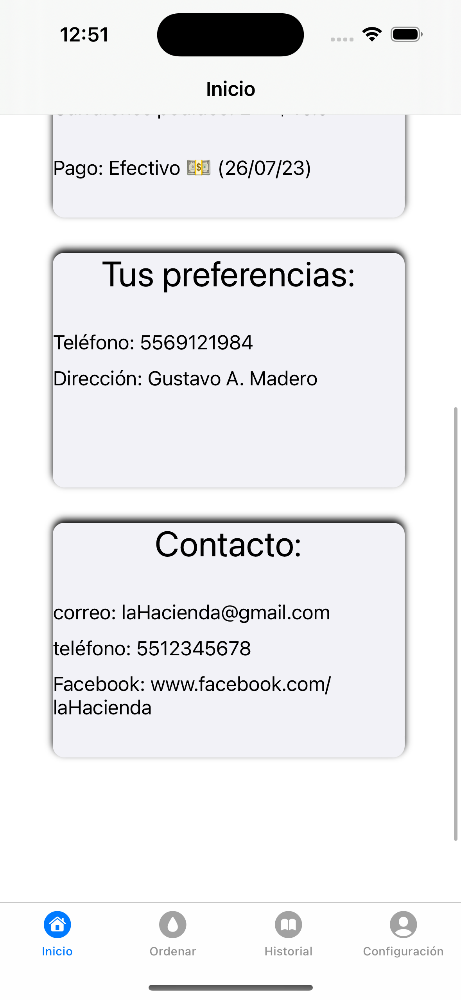

**Desde la pantalla de Ordenar, el usuario puede colocar una nueva orden, visualizar los detalles de la misma, chatear por medio de comentarios con el administrador, y cancelar la orden.**

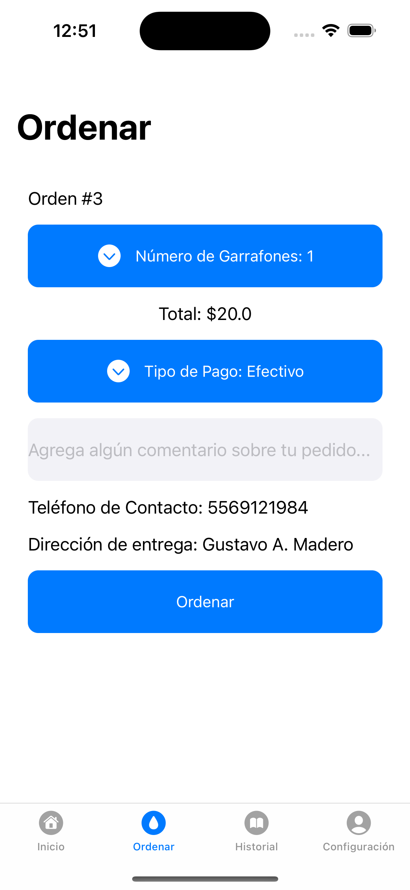
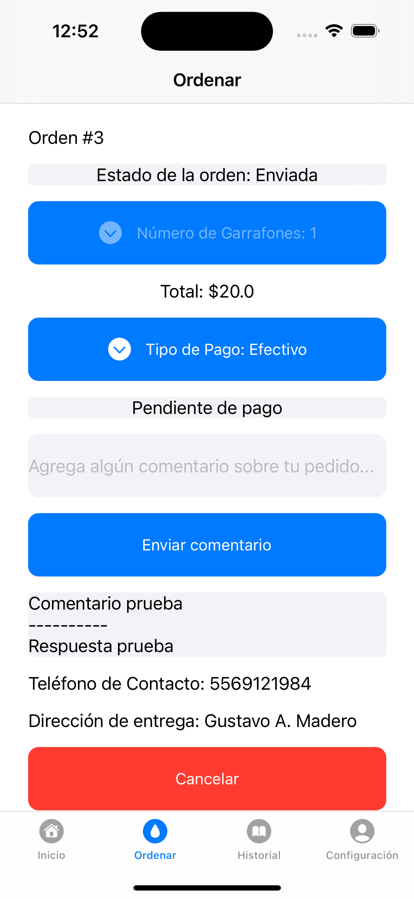

**Desde la pantalla de Historial, el usuario puede visualizar las ordenes colocadas de forma histórica con algunos detalles relevantes, incluida su orden activa si la hubiera**

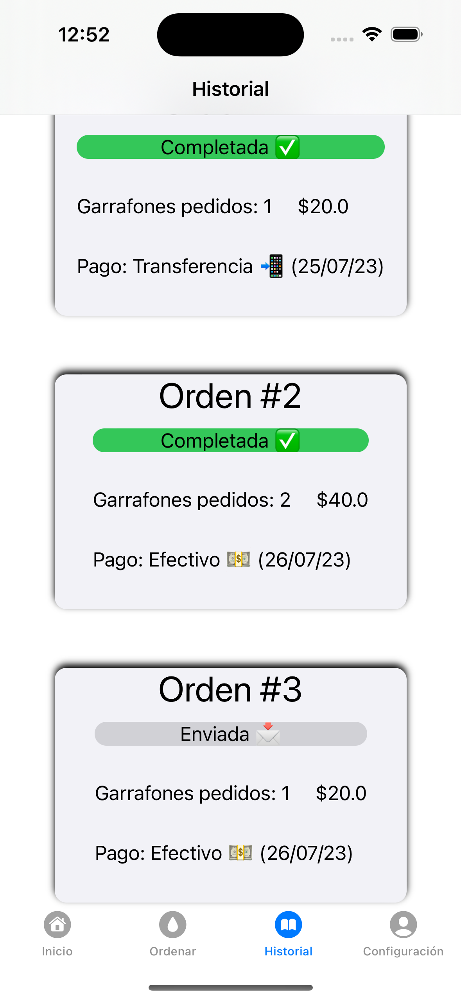

**Finalmente, desde la pantalla de Configuración, el usuario puede modificar sus datos de contacto y nombre, y cerrar su sesión**

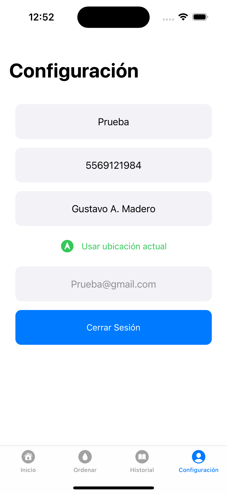

## Tecnologías/Frameworks

- **UIKit:** Para el diseño de la interfaz de usuario.
- **Google FireBase:** Para el servicio de autenticación y base de datos.
- **Combine:** Para la implementación de observadores.
- **MVVM:** Como arquitectura de diseño principal.
- **MapKit:** Para la generación de mapas y direcciones.
- **UIView.animation:** Para las animaciones de algunos elementos de la interfaz de usuario.

## Licenciamiento

- **Derechos reservados para uso y comercialización por Brian Jiménez Moedano, autor y desarrollador.**
